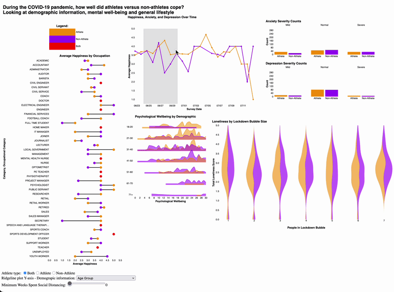

# COVID-19 Athlete vs Non-Athlete Well-Being Dashboard

## Summary

This project explores how athletes and non-athletes experienced the COVID-19 pandemic across measures of mental well-being, lifestyle, and demographic characteristics. The dashboard compares outcomes such as happiness, loneliness, anxiety, depression, and psychological well-being, while allowing users to examine how these patterns vary by occupation, gender, smoking status, social distancing conditions, and other factors.

The aim is to highlight patterns in coping and adjustment during the pandemic, and to examine whether athletic involvement is associated with differences in resilience, mental health, and social well-being.

This dashboard is intended for health professionals, members of the athletic community, and researchers in sports science, psychology, sociology, and public health.

## Demo



## Features

The dashboard supports interactive comparison of athletes and non-athletes across several dimensions of well-being during the COVID-19 pandemic.

- **Average happiness by occupation**  
  Compare average happiness scores across occupations, with tooltips showing exact values and group differences.

- **Linked happiness and severity views**  
  Explore changes in average happiness over survey dates alongside grouped counts of anxiety and depression severity. Brushing the time range updates severity counts, and selecting athlete status updates the happiness trend.

- **Loneliness by quarantine conditions**  
  Examine how loneliness varies by quarantine bubble size and weeks spent social distancing.

- **Psychological well-being by demographic factor**  
  Compare psychological well-being across demographic groups such as gender, smoking status, marital status, and occupation.

- **Interactive filtering and selection**  
  Focus on athletes, non-athletes, or both using dropdowns, sliders, linked selections, and tooltips.

## Key Questions

This dashboard helps users explore questions such as:

- How does happiness change over time for athletes and non-athletes?
- How does loneliness vary by quarantine bubble size?
- How does psychological well-being differ across demographic groups?
- What are the counts of normal, mild, and severe anxiety and depression for each group?
- How does average happiness vary across occupations?
- Which occupations show the largest athlete vs non-athlete differences in happiness?
- Which group has the lowest average happiness?
- How do loneliness, happiness, depression, anxiety, and interest in life compare by athlete status?

## Why This Dashboard Is Useful

The dashboard combines broad comparisons with subgroup-level exploration, making it easier to identify differences in well-being, social isolation, and lifestyle adjustment during the pandemic. Its linked and interactive design allows users to move between overall trends and more detailed demographic patterns.

Users can use it to examine:

- differences in happiness across occupations
- mental health differences between athletes and non-athletes
- relationships between loneliness and social distancing conditions
- how demographic factors relate to psychological well-being
- possible differences in coping during COVID-19

## Local Setup

### 1. Clone

```bash
git clone https://github.com/jadeeechen/covid-athlete-dashboard.git
cd covid-athlete-dashboard.git
````

### 2. Environment

**Conda (recommended)**

```bash
conda env create -f environment.yml
conda activate covid-athlete-dashboard
```

### 3. Run

```bash
make run
```

### 4. Clean

```bash
make clean
```

## Dataset

This project uses survey data collected to compare athletes and non-athletes during the COVID-19 pandemic.

Example fields include:

| Column                    | Description                           |
| ------------------------- | ------------------------------------- |
| `Athlete/Non-Athlete`     | Athlete status                        |
| `Survey Date:`            | Date of survey response               |
| `Occupation:`             | Occupation category                   |
| `Gender:`                 | Gender                                |
| `Smoking Status:`         | Smoking category                      |
| `Weeks Social Distancing` | Duration of social distancing         |
| `# in lockdown bubble:`   | Number of people in quarantine bubble |
| `Happy`                   | Happiness score                       |
| `Interested in life`      | Interest in life score                |
| `MHC-SF OVERALL`          | Overall mental health continuum score |
| `Emotional Wellbeing`     | Emotional well-being score            |

## Strengths

* Compares athletes and non-athletes across multiple well-being outcomes rather than a single measure.
* Uses linked, interactive views to support deeper exploration.
* Highlights possible differences in coping during the pandemic.

## Limitations

* Much of the data comes from the UK, Ireland, and Australia, which may limit generalizability.
* The dataset does not include pre-pandemic baseline data, so changes over time cannot be directly assessed.
